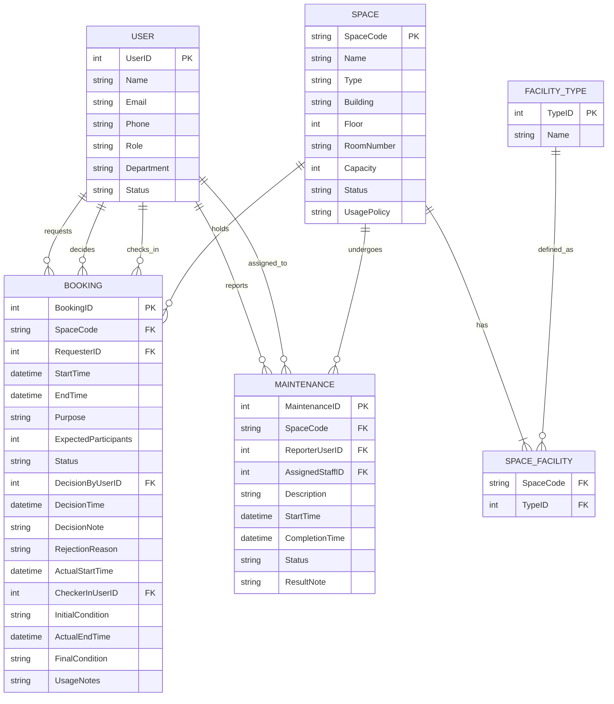

# ERD Design - Group 04

```mermaid
erDiagram
    USER ||--o{ BOOKING : requests
    USER ||--o{ BOOKING : decides
    USER ||--o{ BOOKING : checks_in
    USER ||--o{ MAINTENANCE : reports
    USER ||--o{ MAINTENANCE : assigned_to
    SPACE ||--o{ BOOKING : holds
    SPACE ||--o{ MAINTENANCE : undergoes
    SPACE ||--|{ SPACE_FACILITY : has
    FACILITY_TYPE ||--o{ SPACE_FACILITY : defined_as

    USER {
        int UserID PK
        string Name
        string Email
        string Phone
        string Role
        string Department
        string Status
    }
    SPACE {
        string SpaceCode PK
        string Name
        string Type
        string Building
        int Floor
        string RoomNumber
        int Capacity
        string Status
        string UsagePolicy
    }
    FACILITY_TYPE {
        int TypeID PK
        string Name
    }
    SPACE_FACILITY {
        string SpaceCode FK
        int TypeID FK
    }
    BOOKING {
        int BookingID PK
        string SpaceCode FK
        int RequesterID FK
        datetime StartTime
        datetime EndTime
        string Purpose
        int ExpectedParticipants
        string Status
        int DecisionByUserID FK
        datetime DecisionTime
        string DecisionNote
        string RejectionReason
        datetime ActualStartTime
        int CheckerInUserID FK
        string InitialCondition
        datetime ActualEndTime
        string FinalCondition
        string UsageNotes
    }
    MAINTENANCE {
        int MaintenanceID PK
        string SpaceCode FK
        int ReporterUserID FK
        int AssignedStaffID FK
        string Description
        datetime StartTime
        datetime CompletionTime
        string Status
        string ResultNote
    }
```
