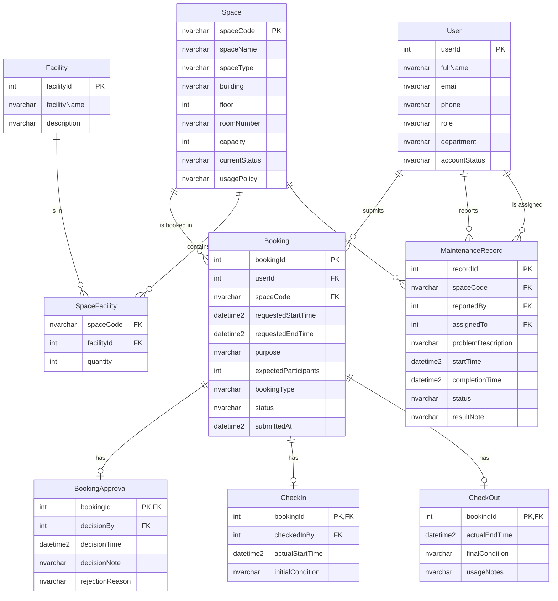

# Conceptual Design / ERD — Group 04

## Entities and Attributes

### User
- `userId` (PK) — Unique identifier
- `fullName` — Full name of the user
- `email` — University email address
- `phone` — Contact phone number
- `role` — One of: student, lecturer, teaching_assistant, facility_staff, department_administrator, facility_manager
- `department` — Academic department
- `accountStatus` — One of: active, suspended, disabled

### Space
- `spaceCode` (PK) — Unique room identifier (e.g., "CS-301")
- `spaceName` — Descriptive name
- `spaceType` — One of: auditorium, classroom, computer_laboratory, project_laboratory, meeting_room, student_workspace
- `building` — Building name or number
- `floor` — Floor number
- `roomNumber` — Room number within the building
- `capacity` — Maximum number of persons
- `currentStatus` — One of: available, in_use, under_maintenance, temporarily_closed, retired
- `usagePolicy` — Text describing usage rules

### Facility
- `facilityId` (PK) — Unique identifier
- `facilityName` — Standardized name (e.g., "Projector", "Whiteboard", "Microphone", "Computer", "Livestreaming Equipment", "Air Conditioner")
- `description` — Optional description

### SpaceFacility
- `spaceCode` (FK) — References Space
- `facilityId` (FK) — References Facility
- `quantity` — Number of units of this facility in the space

### Booking
- `bookingId` (PK) — Unique identifier
- `userId` (FK) — Reference to the requester (User)
- `spaceCode` (FK) — Reference to the booked Space
- `requestedStartTime` — Requested start datetime
- `requestedEndTime` — Requested end datetime
- `purpose` — Description of the intended use
- `expectedParticipants` — Expected number of participants
- `bookingType` — One of: lecture, examination, seminar, workshop, meeting, student_activity, administrative_event
- `status` — One of: pending, approved, rejected, cancelled, checked_in, completed, no_show
- `submittedAt` — Timestamp of submission

### BookingApproval
- `bookingId` (PK & FK) — References Booking
- `decisionBy` (FK) — Staff/manager who decided
- `decisionTime` — When the decision was made
- `decisionNote` — Optional note
- `rejectionReason` — Required if rejected, null otherwise

### CheckIn
- `bookingId` (PK & FK) — References Booking
- `checkedInBy` (FK) — Staff who performed check-in
- `actualStartTime` — Actual start datetime
- `initialCondition` — Space condition at check-in

### CheckOut
- `bookingId` (PK & FK) — References Booking
- `actualEndTime` — Actual end datetime
- `finalCondition` — Space condition at check-out
- `usageNotes` — Notes about the usage

### MaintenanceRecord
- `recordId` (PK) — Unique identifier
- `spaceCode` (FK) — References Space
- `reportedBy` (FK) — Reporter (User)
- `assignedTo` (FK) — Assigned staff (User)
- `problemDescription` — Description of the problem
- `startTime` — When maintenance started
- `completionTime` — When completed (null if ongoing)
- `status` — One of: reported, in_progress, completed, cancelled
- `resultNote` — Outcome notes

## Relationship Summary

| Entity A | Relationship | Entity B | Cardinality |
|---|---|---|---|
| User | submits | Booking | 1 ───< N |
| Space | receives | Booking | 1 ───< N |
| Booking | has | BookingApproval | 1 ─── 0..1 |
| Booking | has | CheckIn | 1 ─── 0..1 |
| Booking | has | CheckOut | 1 ─── 0..1 |
| Space | contains | Facility | M ─── N |
| Space | undergoes | MaintenanceRecord | 1 ───< N |
| User | reports | MaintenanceRecord | 1 ───< N |
| User | is assigned | MaintenanceRecord | 1 ───< N |

## Mermaid ER Diagram

## Key Business Rules

1. **No overlapping bookings**: Two approved/active bookings for the same space must not have overlapping time ranges.
2. **Maintenance blocks booking**: Spaces with active maintenance (status = reported or in_progress) cannot be booked.
3. **Status lifecycle**: pending → approved (or rejected) → checked_in → completed. A booking may also be cancelled (from pending or approved) or become no_show.
4. **Approval before use**: Every booking must be approved before check-in is allowed.

## Assumptions and Open Questions

See `01-business-req-analysis-G04.md` for the full list.
