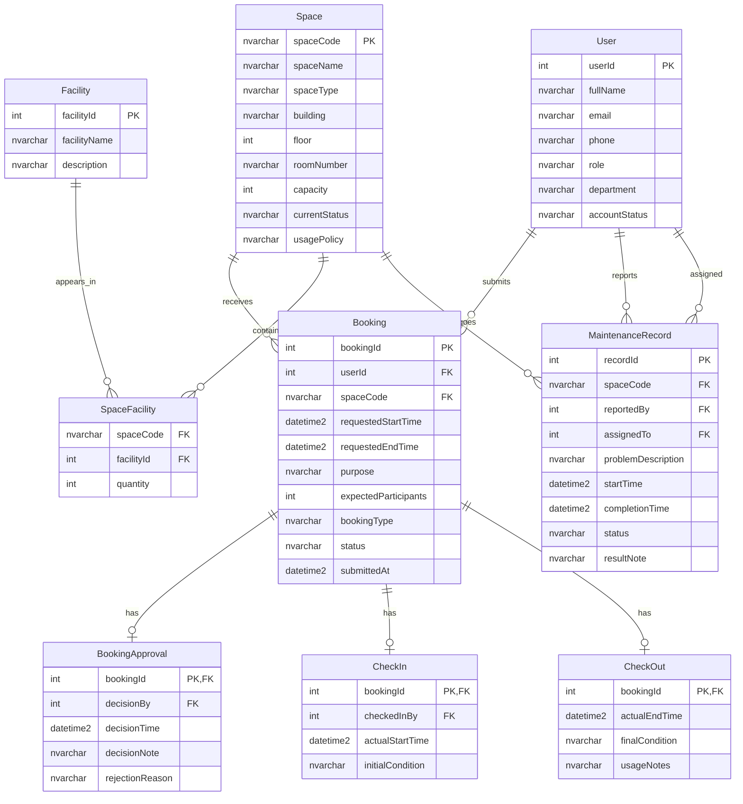

# Conceptual Design / ERD — Group 04

## Entities and Attributes

### User
- `userId` (PK) — Unique identifier, IDENTITY(1,1)
- `fullName` — Full name
- `email` — University email, UNIQUE
- `phone` — Contact phone, nullable
- `role` — student, lecturer, teaching_assistant, facility_staff, department_administrator, facility_manager
- `department` — Academic department, nullable
- `accountStatus` — active, suspended, disabled

### Space
- `spaceCode` (PK) — Unique room code (e.g., "CS-301")
- `spaceName` — Descriptive name
- `spaceType` — auditorium, classroom, computer_laboratory, project_laboratory, meeting_room, student_workspace
- `building` — Building name
- `floor` — Floor number
- `roomNumber` — Room number
- `capacity` — Max persons, > 0
- `currentStatus` — available, in_use, under_maintenance, temporarily_closed, retired
- `usagePolicy` — Text description, nullable

### Facility
- `facilityId` (PK) — Unique identifier, IDENTITY(1,1)
- `facilityName` — Standardized name, UNIQUE
- `description` — Optional description, nullable

### SpaceFacility
- `spaceCode` (FK) → Space(spaceCode)
- `facilityId` (FK) → Facility(facilityId)
- `quantity` — Number of units, DEFAULT 1

### Booking
- `bookingId` (PK) — Unique identifier, IDENTITY(1,1)
- `userId` (FK) → User(userId)
- `spaceCode` (FK) → Space(spaceCode)
- `requestedStartTime` — Requested start DATETIME2
- `requestedEndTime` — Requested end DATETIME2, CHECK (end > start)
- `purpose` — Intended use description, nullable
- `expectedParticipants` — Count, > 0
- `bookingType` — lecture, examination, seminar, workshop, meeting, student_activity, administrative_event
- `status` — pending, approved, rejected, cancelled, checked_in, completed, no_show
- `submittedAt` — Submission timestamp, DEFAULT SYSUTCDATETIME()

### BookingApproval
- `bookingId` (PK, FK) → Booking(bookingId)
- `decisionBy` (FK) → User(userId)
- `decisionTime` — Decision timestamp
- `decisionNote` — Optional note, nullable
- `rejectionReason` — Required if rejected, nullable otherwise

### CheckIn
- `bookingId` (PK, FK) → Booking(bookingId)
- `checkedInBy` (FK) → User(userId)
- `actualStartTime` — Actual start DATETIME2
- `initialCondition` — Room condition at check-in, nullable

### CheckOut
- `bookingId` (PK, FK) → Booking(bookingId)
- `actualEndTime` — Actual end DATETIME2
- `finalCondition` — Room condition at check-out, nullable
- `usageNotes` — Free text notes, nullable

### MaintenanceRecord
- `recordId` (PK) — Unique identifier, IDENTITY(1,1)
- `spaceCode` (FK) → Space(spaceCode)
- `reportedBy` (FK) → User(userId)
- `assignedTo` (FK) → User(userId), nullable
- `problemDescription` — Problem details
- `startTime` — Maintenance start DATETIME2
- `completionTime` — Completion DATETIME2, nullable
- `status` — reported, in_progress, completed, cancelled
- `resultNote` — Outcome notes, nullable

## Mermaid ER Diagram

## Business Rules

1. **No overlapping**: Two approved/checked_in/completed bookings for the same space must not have overlapping time ranges.
2. **Maintenance blocks booking**: Space with active maintenance (status = reported/in_progress) cannot be booked.
3. **Status lifecycle**: pending → approved (or rejected) → checked_in → completed. Cancelled from pending/approved. No-show from approved without check-in.
4. **Approval required**: Booking must be approved before check-in is permitted.
5. **Closed/retired spaces**: Spaces with status temporarily_closed or retired cannot accept new bookings.

## Assumptions and Open Questions

Refer to `01-business-req-analysis-G04.md` for full list.
