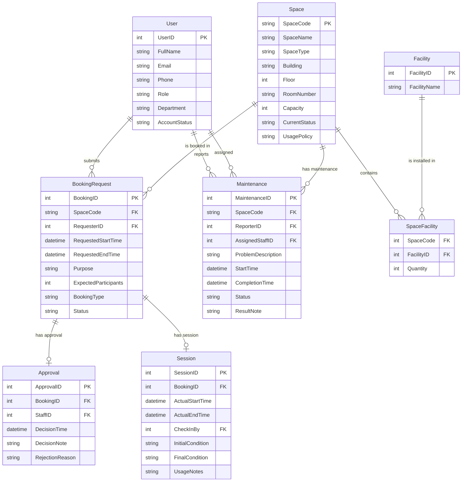

# Conceptual Design — ERD

## Mermaid ER Diagram

## Main Entities with Identifiers and Key Attributes

| Entity | Identifier | Key Attributes |
|--------|-----------|----------------|
| User | UserID (int, PK) | FullName, Email, Role, AccountStatus |
| Space | SpaceCode (string, PK) | SpaceName, SpaceType, Capacity, CurrentStatus |
| Facility | FacilityID (int, PK) | FacilityName |
| SpaceFacility | Composite (SpaceCode, FacilityID) | Quantity |
| BookingRequest | BookingID (int, PK) | RequestedStartTime, RequestedEndTime, Status |
| Approval | ApprovalID (int, PK) | DecisionTime, DecisionNote |
| Session | SessionID (int, PK) | ActualStartTime, ActualEndTime |
| Maintenance | MaintenanceID (int, PK) | ProblemDescription, StartTime, Status |

## Relationship Names, Cardinalities, and Participation Constraints

| Relationship | From | To | Cardinality | Participation |
|-------------|------|----|-------------|---------------|
| submits | User | BookingRequest | 1:N | User: optional, BookingRequest: mandatory |
| reports | User | Maintenance | 1:N | User: optional, Maintenance: mandatory |
| assigned | User | Maintenance | 1:N | User: optional, Maintenance: optional |
| is booked in | Space | BookingRequest | 1:N | Space: optional, BookingRequest: mandatory |
| contains | Space | SpaceFacility | 1:N | Space: mandatory, SpaceFacility: mandatory |
| is installed in | Facility | SpaceFacility | 1:N | Facility: optional, SpaceFacility: mandatory |
| has maintenance | Space | Maintenance | 1:N | Space: optional, Maintenance: mandatory |
| has approval | BookingRequest | Approval | 1:1 | BookingRequest: optional, Approval: mandatory |
| has session | BookingRequest | Session | 1:1 | BookingRequest: optional, Session: optional |

## Notes

- **Optionality**: Approval is mandatory for every approved booking; Session is optional (only recorded when check-in occurs).
- **Historical tracking**: Completed and cancelled bookings remain in the database; Status field drives visibility.
- **Status-driven behavior**: Space.CurrentStatus controls bookability; BookingRequest.Status controls lifecycle.
- **Many-to-many**: Space ↔ Facility is resolved via the associative entity SpaceFacility.

## Assumptions

1. A Space can have zero or more Facilities; a Facility can exist in zero or more Spaces (many-to-many via SpaceFacility).
2. Approval is 1:1 with BookingRequest — a booking receives exactly one approval/rejection decision.
3. Session is 1:1 with BookingRequest — each booking has at most one check-in/check-out record.
4. A maintenance record is assigned to exactly one staff member; a staff member can handle many maintenance records.
